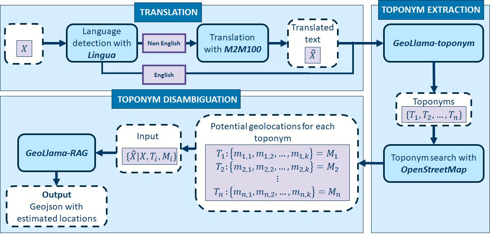

# GeoLlama
### A Llama3 based multi-lingual geoparsing pipeline
This app is designed to accurately and consistently translate and geoparse textual data. We use a three step pipeline. First, text is translated using the `M2M100` model from meta, then we extract toponyms using the bespoke fine-tuned `GeoLlama-7b-toponym` model. We then use OpenStreetMaps to find potential geolocations for these toponyms, and use the `GeoLlama-7b-RAG` model to identify which geolocation is most likely to be an accurate representation of the true toponym location. 

This process is outlined in figure1.

## Requirements
All package sources listed in `requirements.txt`:
- accelerate==0.33
- geopy
- gradio
- huggingface-hub
- jupyter
- lingua-language-detector
- pandas
- tokenizers
- torch==2.3.1+cu121 # depending on cuda version
- tqdm
- transformers
- unsloth

## Usage
The script `app.py` will deploy a gradio web browser app which runs the model. The model requires significant GPU capabilities to run effectively - typical usage is around 12Gb of GPU RAM. The package can be tested without using the gradio interface in the `testing.ipynb` notebook. This runs through testing the model on the `News2024` dataset - a set of geo-tagged news articles from outside of the training window for Llama3. 